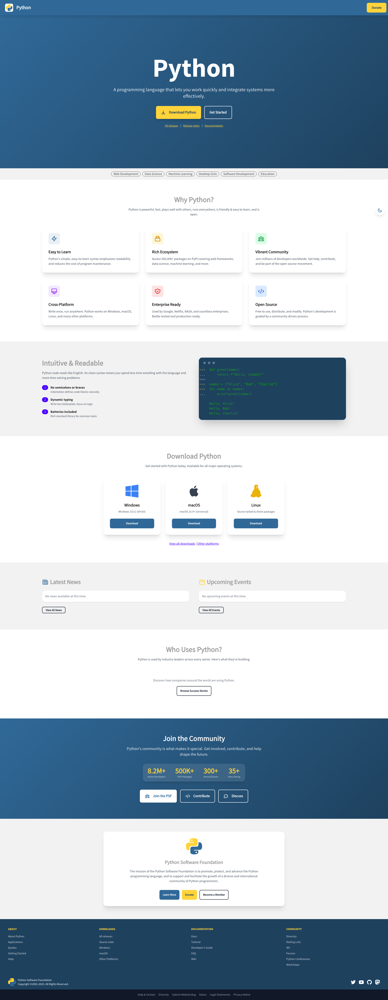
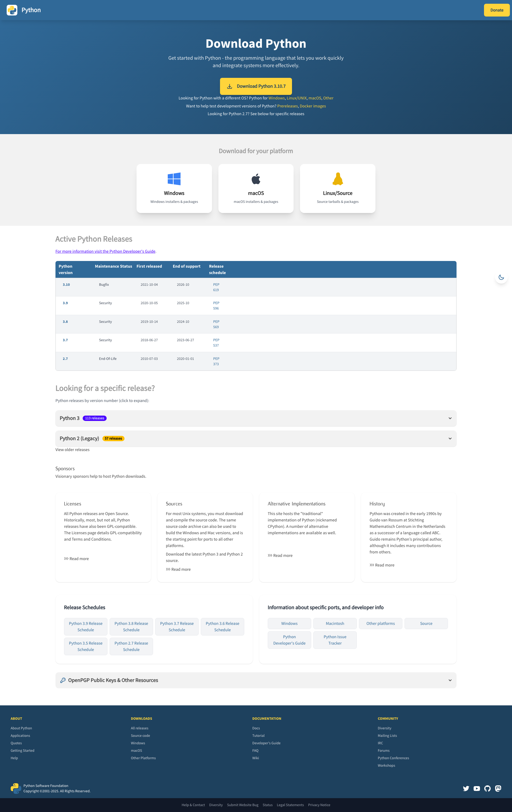
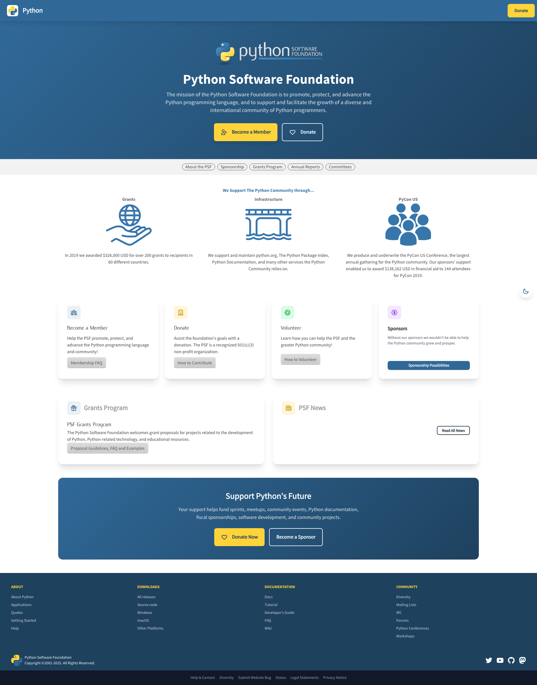
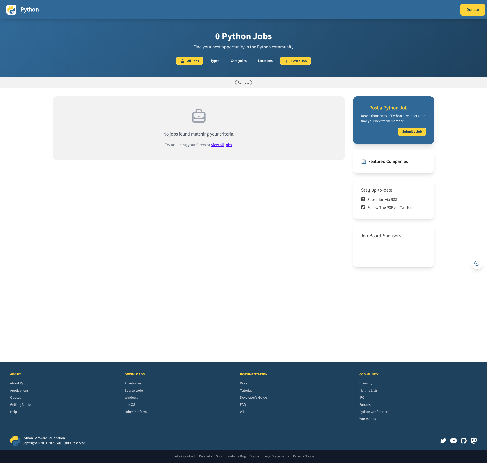
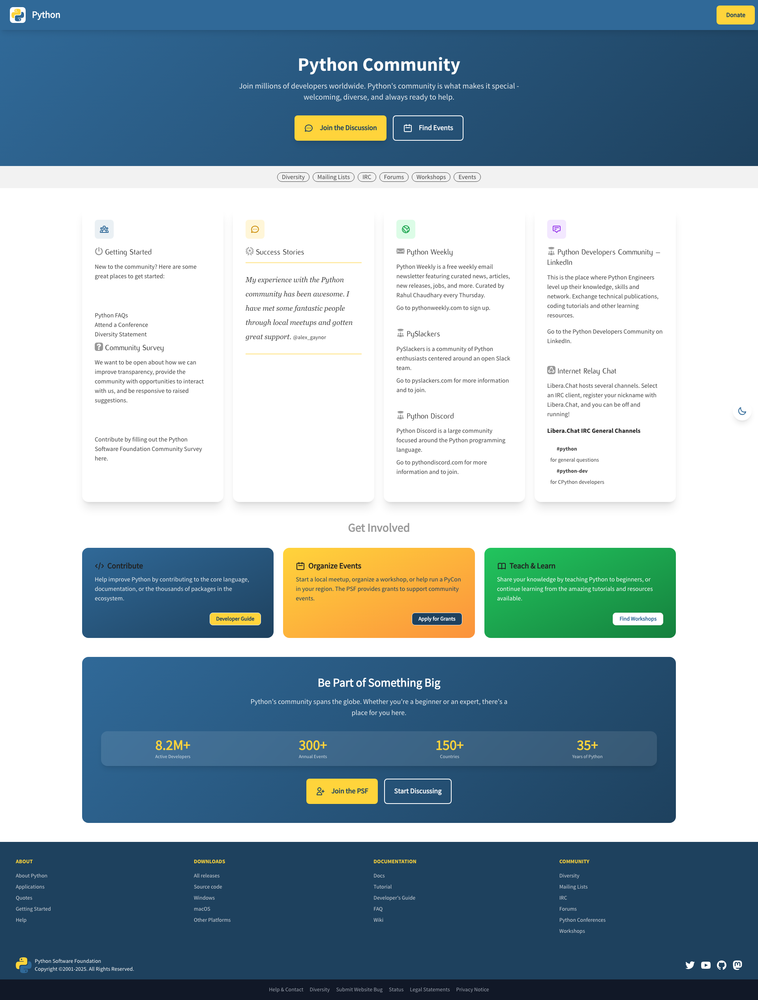

# python.org

[](https://github.com/python/pythondotorg/actions/workflows/ci.yml)
[](https://pythondotorg.readthedocs.io/?badge=latest)

---

## Modern UI Redesign (Branch: `modern-ui-redesign`)

This branch contains a proof-of-concept modernization of python.org using **Tailwind CSS** and **DaisyUI**.

### Screenshots

**Homepage (`/`)**



**Downloads Page (`/downloads/`)**



**PSF Landing Page (`/psf-landing/`)**



**Jobs Board (`/jobs/`)**



**Community Page (`/community/`)**



Screenshots cap'd with `uvx --with playwright python capture_screenshots.py`

### What's Changed

- Added Tailwind CSS via CDN
- Added DaisyUI component library
- Redesigned homepage with modern layout and components
- Redesigned downloads page with collapsible release sections
- Modernized PSF landing page with hero section, feature cards, and CTAs
- Redesigned jobs board with card-based listings and improved filters
- New community page with engagement cards and stats section
- Updated navbar and footer across all pages

### How to See

```bash
# Clone and checkout branch
git clone https://github.com/JacobCoffee/pythondotorg.git
cd pythondotorg
git checkout modern-ui-redesign
make serve

# Visit http://127.0.0.1:8000
```

---

### General information

This is the repository and issue tracker for [python.org](https://www.python.org).

> [!NOTE]
> The repository for CPython itself is at https://github.com/python/cpython, and the
> issue tracker is at https://github.com/python/cpython/issues/.
>
> Similarly, issues related to [Python's documentation](https://docs.python.org) can be filed in
> https://github.com/python/cpython/issues/.

### Contributing

* Source code: https://github.com/python/pythondotorg
* Issue tracker: https://github.com/python/pythondotorg/issues
* Documentation: https://pythondotorg.readthedocs.io/
* Mailing list: [pydotorg-www](https://mail.python.org/mailman/listinfo/pydotorg-www)
* IRC: `#pydotorg` on Freenode
* License: Apache License
