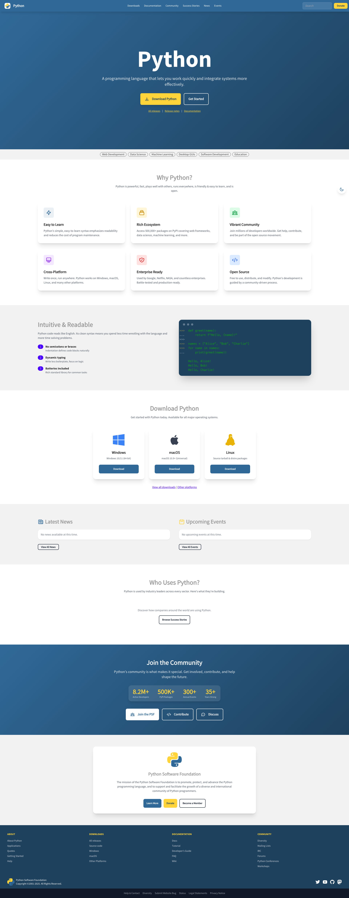
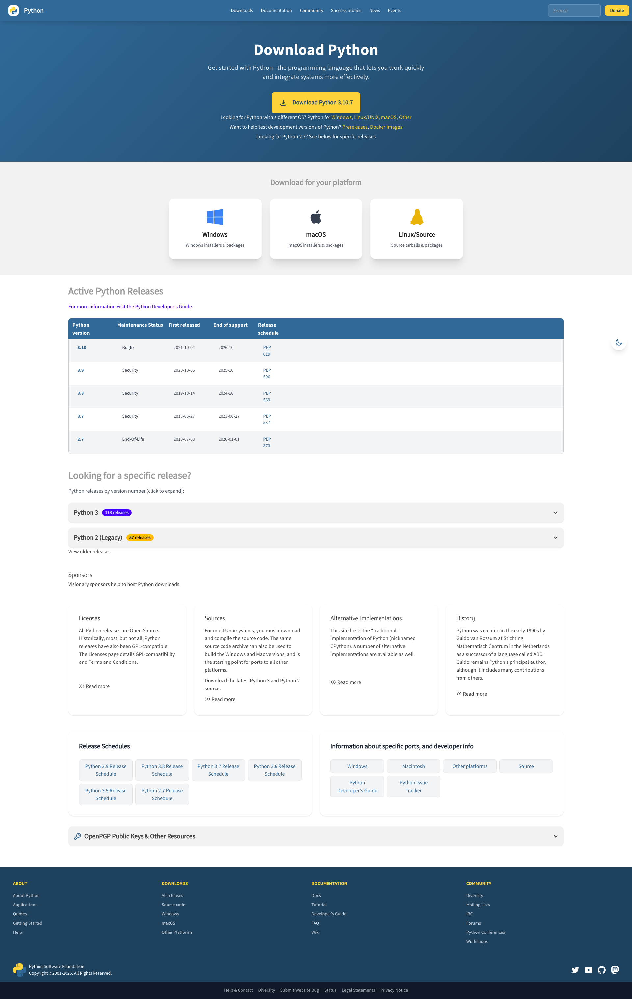
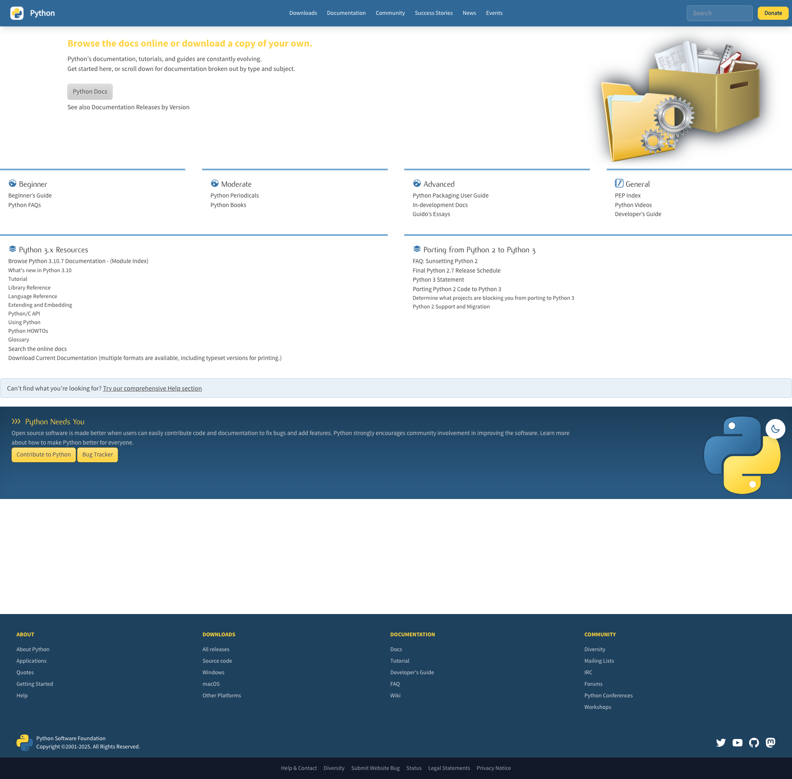
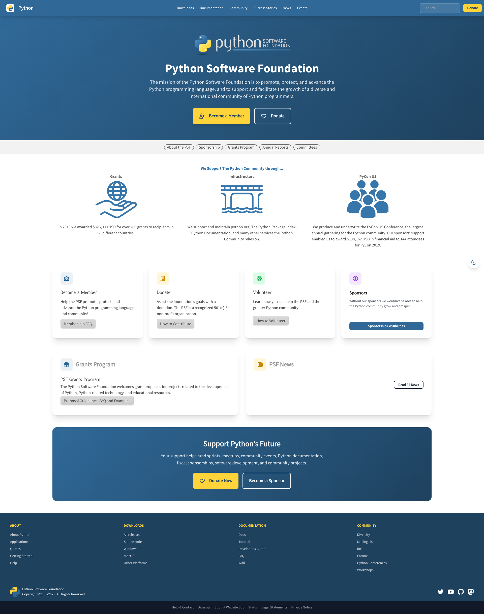
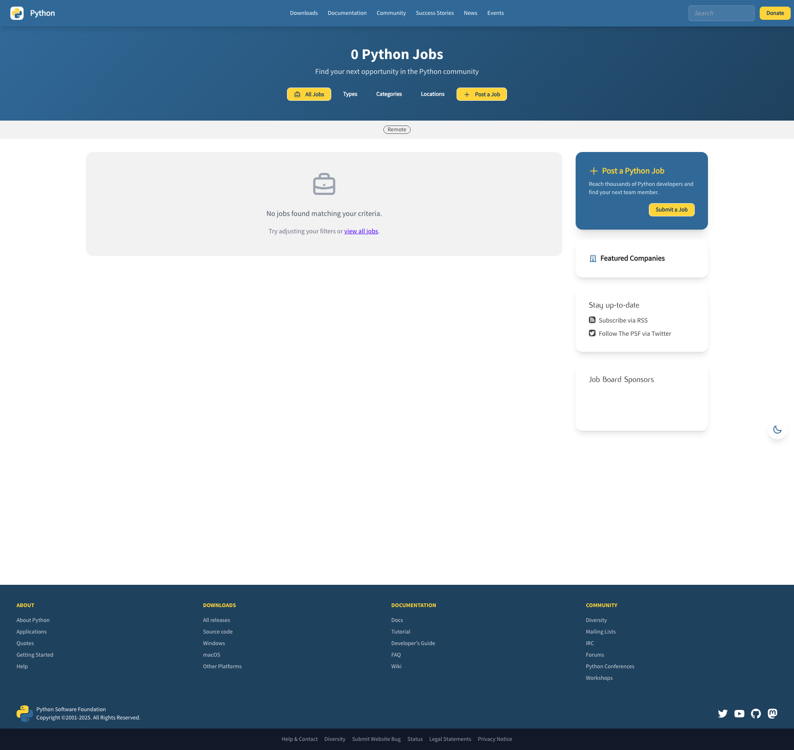
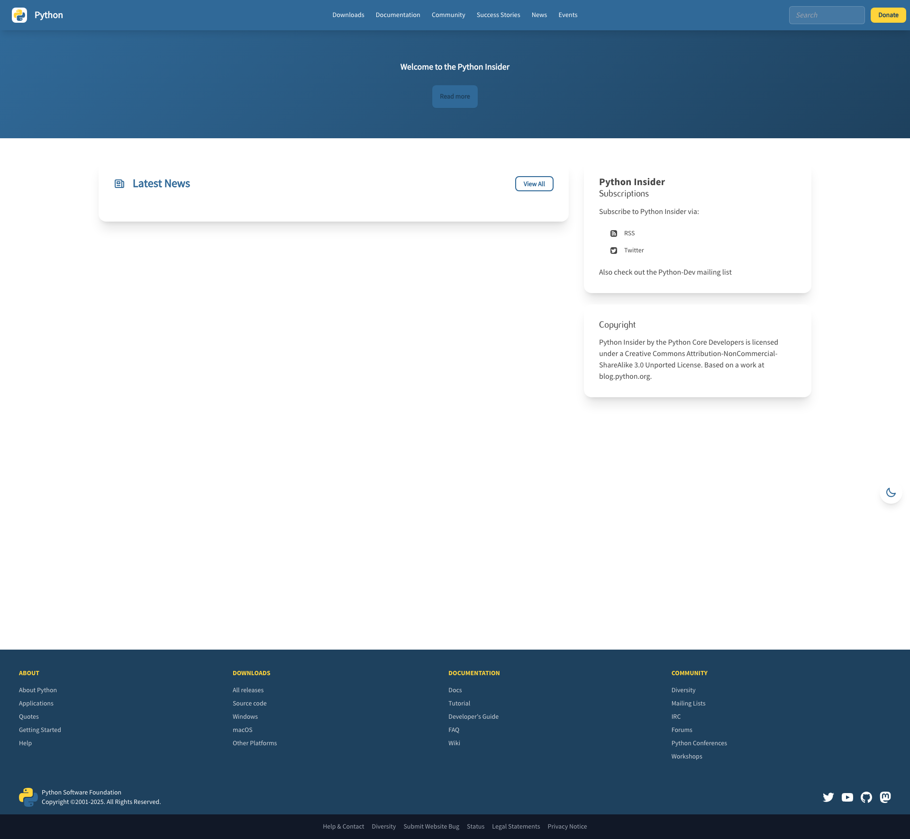
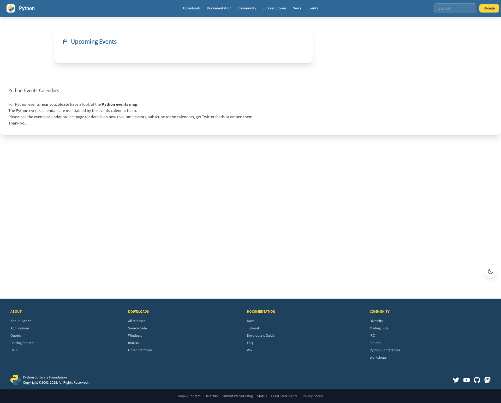
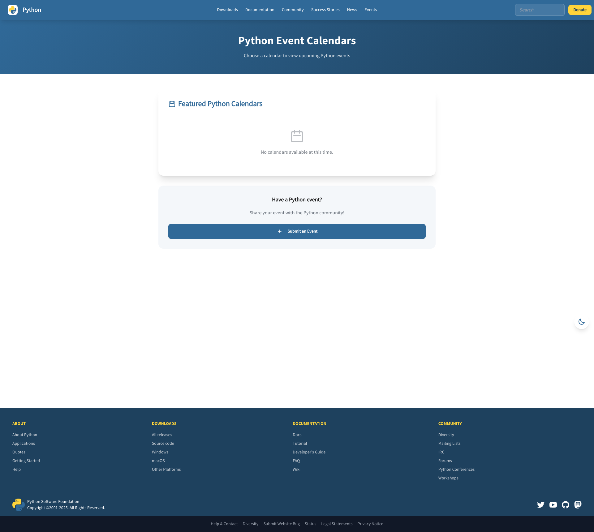
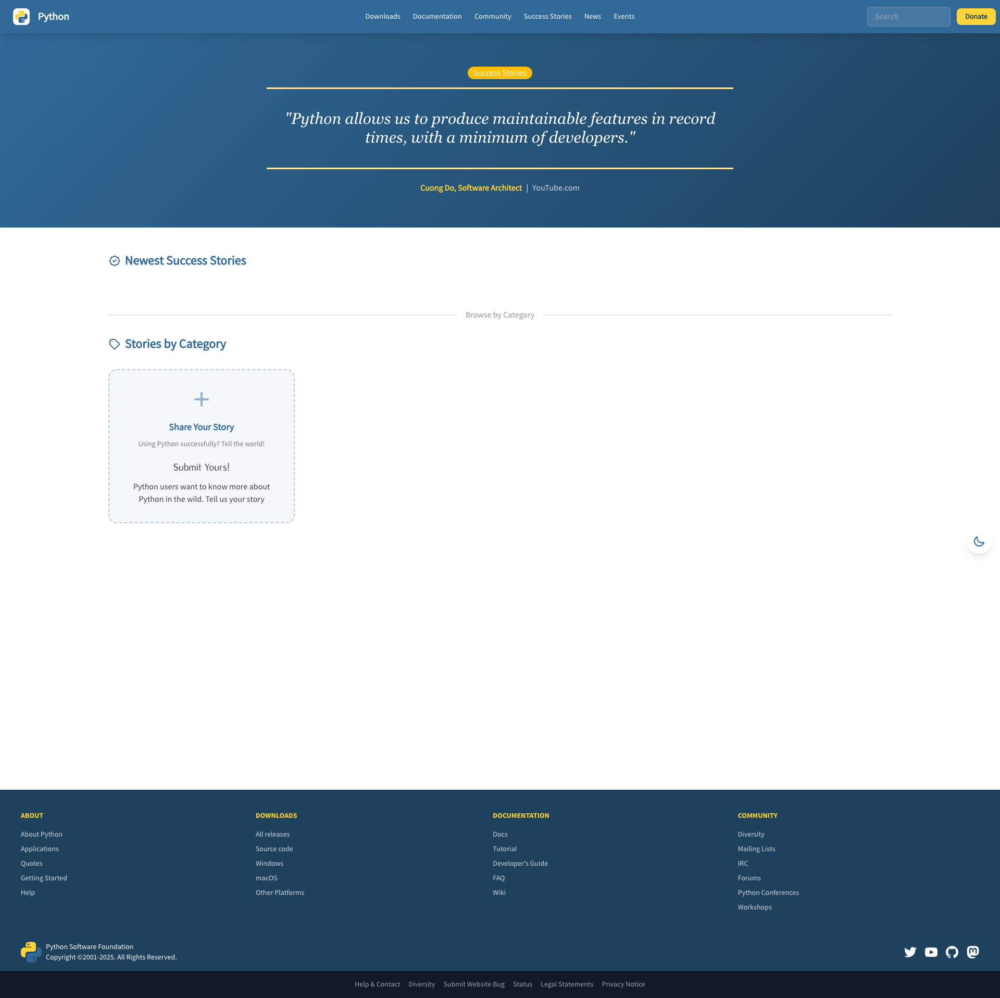
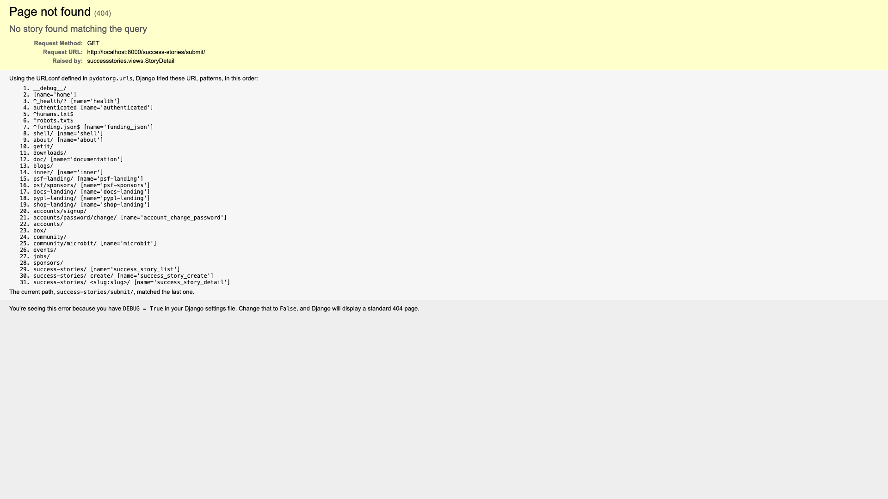

# python.org

[](https://github.com/python/pythondotorg/actions/workflows/ci.yml)
[](https://pythondotorg.readthedocs.io/?badge=latest)

---

## Modern UI Redesign (Branch: `modern-ui-redesign`)

This branch contains a proof-of-concept modernization of python.org using **Tailwind CSS** and **DaisyUI**.

### Screenshots

<table>
<tr>
<td width="50%">
<strong>Homepage</strong><br>

</td>
<td width="50%">
<strong>Downloads</strong><br>

</td>
</tr>
<tr>
<td width="50%">
<strong>Documentation</strong><br>

</td>
<td width="50%">
<strong>PSF Landing</strong><br>

</td>
</tr>
<tr>
<td width="50%">
<strong>Jobs Board</strong><br>

</td>
<td width="50%">
<strong>Community</strong><br>

</td>
</tr>
<tr>
<td width="50%">
<strong>Blogs</strong><br>

</td>
<td width="50%">
<strong>Events</strong><br>

</td>
</tr>
<tr>
<td width="50%">
<strong>Events Calendars</strong><br>

</td>
<td width="50%">
<strong>Success Stories</strong><br>

</td>
</tr>
<tr>
<td width="50%">
<strong>Submit Story</strong><br>

</td>
<td width="50%">
</td>
</tr>
</table>

> Screenshots captured with `uvx --with playwright python capture_screenshots.py`

### What's Changed

**Core Infrastructure:**
- Added Tailwind CSS via CDN
- Added DaisyUI component library
- Custom Python brand colors (`python-blue`, `python-yellow`, `python-dark`)
- Dark mode support with theme toggle
- Responsive design across all breakpoints

**Pages Updated:**
- **Homepage** - Hero section, feature cards, stats display
- **Downloads** - Platform cards, release tables, PGP key info
- **Documentation** - Resource cards, version links, developer guides
- **PSF Landing** - Mission section, feature cards, CTAs
- **Jobs Board** - Card-based listings, improved filters
- **Community** - Engagement cards, stats section
- **Blogs** - News feed with sidebar widgets
- **Events** - Event listings, calendar views, submission forms
- **Success Stories** - Story cards, category browsing, submission form

### How to See

```bash
# Clone and checkout branch
git clone https://github.com/JacobCoffee/pythondotorg.git
cd pythondotorg
git checkout modern-ui-redesign
make serve

# Visit http://127.0.0.1:8000
```

---

### General information

This is the repository and issue tracker for [python.org](https://www.python.org).

> [!NOTE]
> The repository for CPython itself is at https://github.com/python/cpython, and the
> issue tracker is at https://github.com/python/cpython/issues/.
>
> Similarly, issues related to [Python's documentation](https://docs.python.org) can be filed in
> https://github.com/python/cpython/issues/.

### Contributing

* Source code: https://github.com/python/pythondotorg
* Issue tracker: https://github.com/python/pythondotorg/issues
* Documentation: https://pythondotorg.readthedocs.io/
* Mailing list: [pydotorg-www](https://mail.python.org/mailman/listinfo/pydotorg-www)
* IRC: `#pydotorg` on Freenode
* License: Apache License
